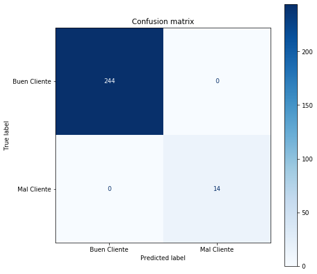

# credit-score
En este proyecto se propone la construcción de modelo predictivo que permita determinar el comportamiento de un buen o mal cliente, a partir de su historial de pago de un crédito.

Para lograr esto, se parte de una base de datos anónima de una entidad bancaria. Con esta base de datos se sigue el siguiente flujo de trabajo (El flujo de trabajo se encuentra desarrolado en el archivo [credit_score.ipynb](credit_score.ipynb)): 

## 1. Data Pre-Processing

Es necesario limpiar los datos y consolidar los datos para entrenar los modelos.

## 2. Descriptive Statistics

Se hace un análisis descriptivo básico para saber el comportamiento general de las variables.

## 3. Feature Engineering

Con las variables históricas del pago del crédito, se construyen nuevas características para entrenar el modelo predictivo.

## 4. Segmentation Class

Se construye la etiqueta de mal o buen cliente a partir del historial de pago. Se crean dos etiquetas, cuando se tiene una mora de 30 días y otra cuando se tiene una mora 90 días, para los malos clientes. 

## 5. Model training

Con todo lo anterior se construye dos modelos predictivos de Regresión Logística

## 6. Models Evaluation

Se evalúa los modelos obtenidos.

A continuación se observa la matriz de confusión para el primer modelo (mora de 30 días)

Y finalmente para el segundo modelo (mora de 90 días), se obtiene: 

